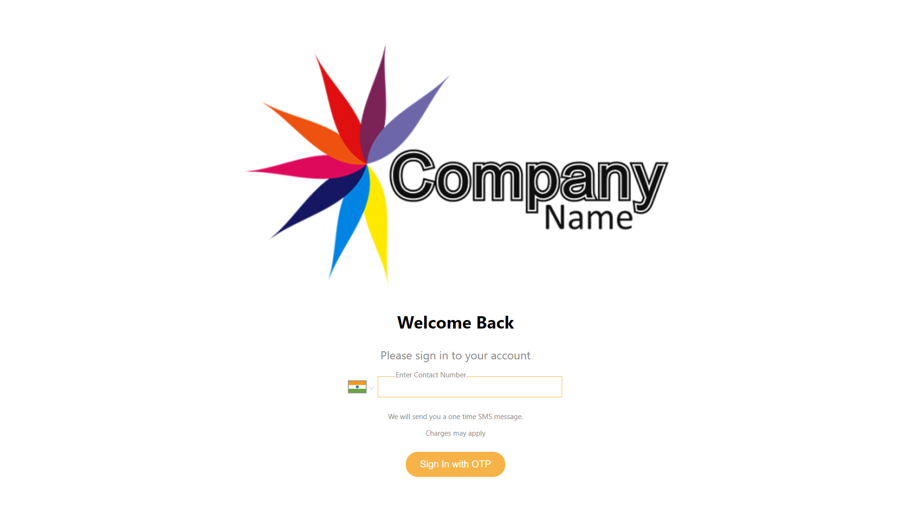
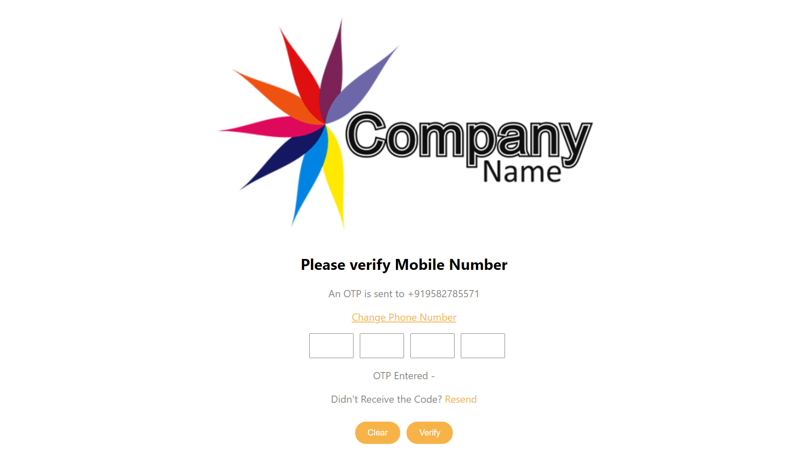
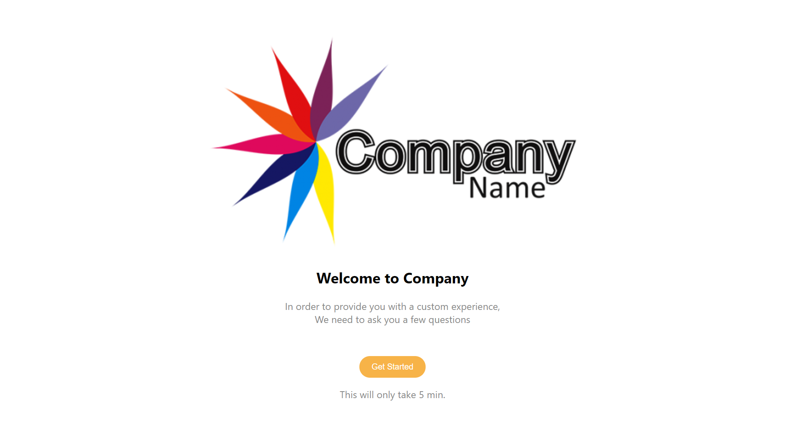

# Read Me Template

> This is an OTP verification application. You can checkout hosted App at: `https://otp-verif.herokuapp.com/`

---

### Table of Contents

- [Description](#description)
- [How To Use](#how-to-use)
- [References](#references)
- [Author Info](#author-info)

---

## Description

This in an OTP verification App. When you enter your phone number, the frontend will reference the API to generate an OTP which will be displayed on your screen in an alert box. After this, you will be asked to enter the OTP in a new screen. If OTP matches, you will be redirected to the Welcome Screen, otherwise you will have to enter OTP again.

#### Technologies

- ReactJs(Forntend)
- NodeJs/ExpressJs(Backend)
- HTML
- CSS

---

## How To Use

#### Installation

- To run, simply clone or download the repository to your system.
- Navigate to directory and run `npm install` in terminal to install the dependencies
- Run `npm start` to start the React server(hosts the frontend) on port 3000.
- Type `cd backend` to navigate to backend folder and run `npm start` again to start the backend server on port 8000.
- Now you can visit `http://localhost:3000/` on your browser to see the project
#### API Reference
There are two API reference points in this App. 
1. /api/v1/otp/generateOtp - It is a GET method. An OTP will be generated in the backend and returned to the frontend to be displayed on the browser.
2. /api/v1/otp/verifyOtp - It is a POST method. `userEnteredOtp` is required to be passed in the body of the request. This otp will be matched with the OTP that was generated in the backend. Will return "success" if OTP matches, else "mismatch" will be returned.

---

## References
- https://www.npmjs.com/package/react-phone-number-input - library used to format phone number input.

---
## Screens
#### Login Screen

#### OTP Screen

#### Welcome Screen

---
## Folder Structure
1. Front-end
-Root
 -src
  -components
  -css
  -images
  -index.js

2. Back-end
-Root
 -backend
  -controllers
  -routes
  -index.js

The folder structure is made this way to make the porject more scalable.

---

## Author Info

- LinkedIn - [@lakshdhamija](https://linkedin.com/in/lakshdhamija)
